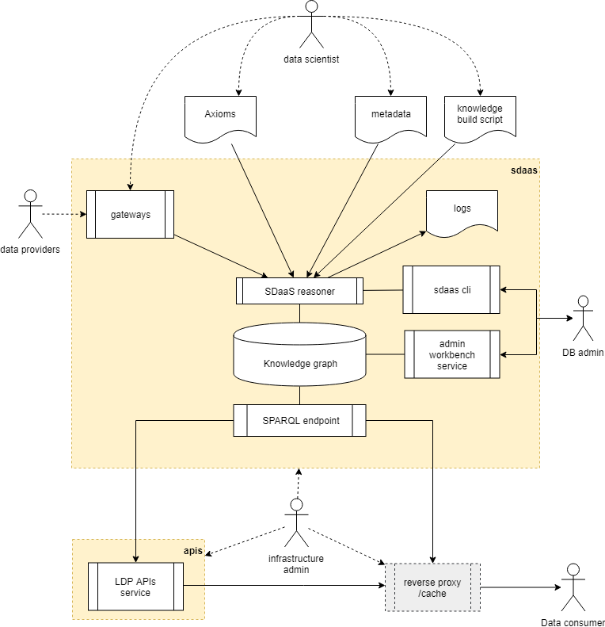

# G0V data-budget

data-budget is the *Smart Data Management Platform* that feeds the http://budget.g0v.it/ web application.

The platform extracts the main financial facts from the official [open data portal](https://bdap-opendata.mef.gov.it) provided 
by the "Ministero dell'Economia e Finance" and produces a knowledge graph according with the [mef-ap profile](mef-ap/README.md).

Data consumer agents (e.g. http://budget.g0v.it/), access such knowledge through a SPARQL service, as suggested by the Semantic Web standards.

The data-budget project uses the [Smart Data as a Service platform (SDaaS)](https://github.com/linkeddatacenter/sdaas-ce) to provide:

- a set of gateways to transform the raw data provided by from the [MEF Open Data Portal](https://openbdap.mef.gov.it) into linked data;
- a data ingestion engine and a knowledge graph building script to drive the learning of the Italian Government budget data; 
- an RDF quad-store for persist the knowledge graph; 

data-budget exposes three interfaces:

- a web workbench to interact with the knowledge graph;
- a command line interface to the data ingestion engine; 
- a [SPARQL service](https://www.w3.org/TR/sparql11-overview) endpoint; 

data-budget is designed to be the data provider component of a general system architecture composed by:

- optional *API interfaces* (e.g. LODMAP2D-api) that queries the SPARQL endpoint and exposes knowledge graph portions as expected by software agents. 
- one or more software agents to explore the knowledge graph (e.g LODMAP2D, YASGUI, LODVIEW, etc., etc.)



All used software components are available with **Open Source License**, all data are provided with an **Open Data License**

## Try it with Docker

The platform is shipped with a [Docker](https://docker.com) setup that makes it easy 
to get a containerized development environment up and running. 
If you do not already have Docker on your computer, 
[it's the right time to install it](https://docs.docker.com/install/).

To try the latest platform release, an example stack of services is provided. Just type: 

```
docker-compose up -d
```

This will start locally the following services:


| Name        | Description                                                   | Port 
| ----------- | ------------------------------------------------------------- | ------- 
| sdaas       | the lastest release of data-budget management platform        | 29321    
| api         | an  example API microservice to feed webapp                   | 29322 

- try http://localhost:29321/sdaas to access sdaas workbench
- try http://localhost:29322/app.ttl to test the [LODMAP2D-api](https://github.com/linkeddatacenter/LODMAP2D-api) endpoint


To test the platform with  LODMAP2D type:

```
docker run -d --name lodmap2d -e LODMAP2D_DATA=http://localhost:29322/ -p 29323:80 linkeddatacenter/lodmap2d
```

Point your browser to http://localhost:29323/ refresh the page and enjoy.

The first time you start the containers, Docker downloads and runs the latest versin of the required docker images. 
It will take some time, but don't worry this is done only once. Starting servers will then be lightning fast.


To shutdown the platform type: 

```
docker-compose down
docker rm -f lodmap2d
```

Developers should read [CONTRIBUTING file](CONTRIBUTING.md)

## Support

For answers you may not find in here or in the Wiki, avoid posting issues. Feel free to ask for support on the [Slack](https://copernicani.slack.com/) general room. Make sure to mention **@enrico** so he is notified


## Credits

- the Smart Data Management Platform and LODMAP2D application was developed by [LinkedData.Center](http://LinkedData.Center/)
- data extracted from [Open BDAP portal](https://bdap-opendata.mef.gov.it/) with [CC-BY](http://creativecommons.org/licenses/by/3.0) license
- the RDF datastore and the SPARQL endpoint is based on the [Blazegraph community edition](https://www.blazegraph.com/)

Thanks to all project contributors, to the [Copernicani community](https://copernicani.it/) and to the [g0v asia community](http://g0v.asia) for ideas and support.

## License

The MIT License (MIT). Please see [License File](LICENSE) for more information.
