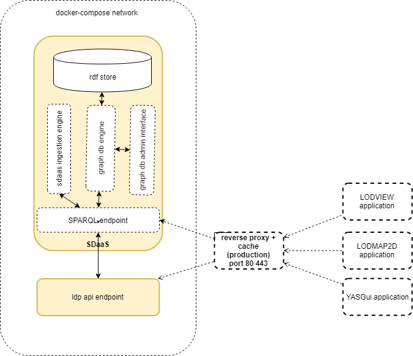

# g0v data-budget

A *Smart Data Management Platform* to feed the http://budget.g0v.it/ web applications.

The plaform is built around a knowledge graph that contains information about
the Italian Government budget and other similar reports, namely:

- "disegno di legge di bilancio" (budget proposal)
- "legge di bilancio" (budget)
- "consuntivo di bilancio" (consolidated balance)

The platform extracts and links main financial facts from the official open data provided by the "Ministero dell'Economia e Finance" producing a knowledge graph that is compliant with the [g0v Financial Report application profile](https://g0v-it.github.io/ontologies/fr-ap) and with the [Bubble Graph Ontology](http://linkeddata.center/lodmap-bgo/v1)

Applications can access the knowledge graph through a SPARQL interface.


**Reference implementations:**

- **SPARQL endpoint**: https://data.budget.g0v.it/sparql
- **Example of a data consumer**: https://budget.g0v.it/


The **sdaas** (smart data as a service) platform  provides a RDF store, a [SPARQL endpoint](https://www.w3.org/TR/sparql11-overview), a data ingestion engine, 
a set of gateways to transform raw data in linked data and a build script that populates the RDF store.

Additional optional components may complete a production system:

- a set of **apis** that query the SPARQL endpoint and expose a linked data interface. 
- a **reverse proxy** that provides a single access point to sparql and api services with security and caching.
- a **linked data web browser** to deferencing URIS and navigate the Knowledge Graph (e.g. LODVIEW).
- an **interactive SPARQL interface** to query the knowledge graph and generating static reports (e.g. YasGui)
- a **data explorer application** like LODVIEW


This picture shows the components interactions:


To deploy the platform a stack of services is required:



The platform is shipped with a [Docker](https://docker.com) setup that makes it easy 
to get a containerized development environment up and running. 
If you do not already have Docker on your computer, 
[it's the right time to install it](https://docs.docker.com/install/).

To start core services using [docker Compose](https://docs.docker.com/compose/) type: 

```
docker-compose build
docker-compose up -d
```

This starts locally the following services:


| Name        | Description                                                   | Port 
| ----------- | ------------------------------------------------------------- | ------- 
| sdaas       | a server that manages the datastore and the ingestion engine  | 29321    
| api         | a server that manages the bgo linked data resources           | 29322 

Try http://localhost:29321/sdaas to access blazegraph workbench
Try http://localhost:29322/ to test api endpoint

The first time you start the containers, Docker downloads and builds images for you. It will take some time, but don't worry
this is done only once. Starting servers will then be lightning fast.


To shudown the platform type: 

```
docker-compose down
```


## Support

For answers you may not find in here or in the Wiki, avoid posting issues. Feel free to ask for support on the [Slack](https://copernicani.slack.com/) general room. Make sure to mention **@enrico** so he is notified


## Credits

- the Smart Data Management Platform and the LODMAP2D Bubble Graph Ontology was developed by [LinkedData.Center](http://LinkedData.Center/)
- data extracted from [Open BDAP portal](https://bdap-opendata.mef.gov.it/) with [CC-BY](http://creativecommons.org/licenses/by/3.0) license
- the RDF datastore and the SPARQL endpoint is based on the [Blazegraph community edition](https://www.blazegraph.com/)

Thanks to all project contributors, to the [Copernicani community](https://copernicani.it/) and to the [g0v asia community](http://g0v.asia) for ideas and support.

The URI dereferencing platform is derived from the [LODView project](https://github.com/dvcama/LodView)


## License

The MIT License (MIT). Please see [License File](LICENSE) for more information.
