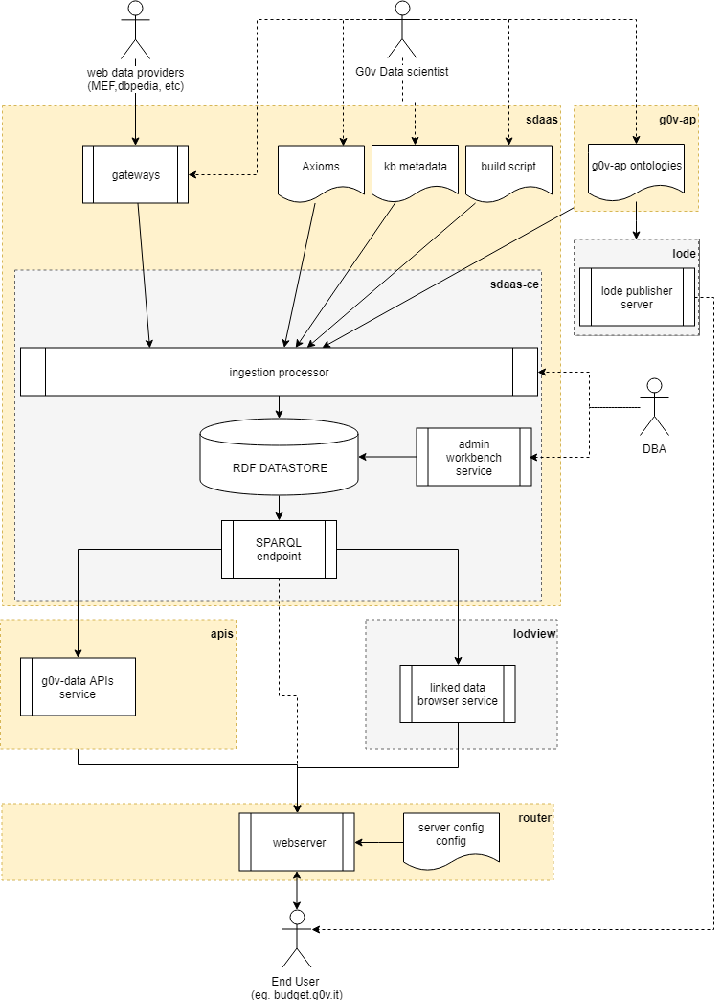
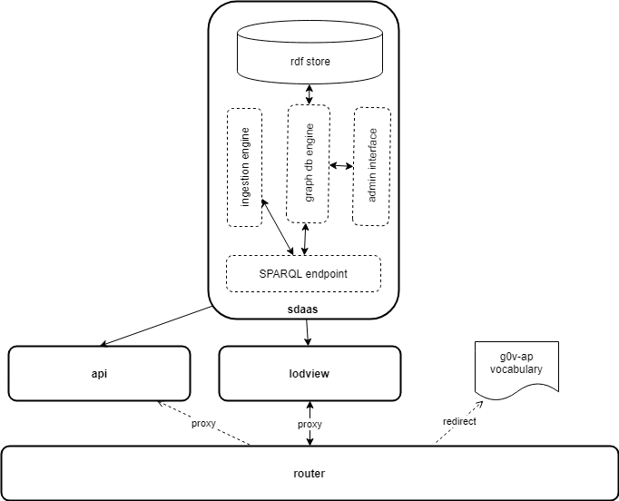

# g0v-data

A simple smart data management platform to feed http://budget.g0v.it/ web application and similar apps. 

This project aims to create a general smart data management platform to feed a budget visualization application based on W3C Semantic Web standards.

**Try it now:**

- **api**: http://data.budget.g0v.it/api/v1
- **linked open data** viewer: http://data.budget.g0v.it/resource/welcome
- **SPARQL endpoint**: http://data.budget.g0v.it:8889/sdaas/#query

## Development

The project contains the following logical components:

- the **g0v-ap**, a general application ontology to describe a budget report with the [W3C RDF Data Cube Vocabulary](https://www.w3.org/TR/vocab-data-cube). Find files and documentation in [g0v-ap directory](g0v-ap/README.md)
- **sdaas** (smart data as a service):  the data management platform core providing a RDF store, a [SPARQL endpoint](https://www.w3.org/TR/sparql11-overview), a data ingestion engine, a set of gateways to transform raw data in linked data according with g0v-ap-api ontology (an application level extension of g0v-ap) and a build script that populates the RDF store. See files and docs in [sdaas directory](sdaas/README.md)
- a set of **apis** that query the SPARQL endpoint and produce json data with a schema suitable to be used with the [vue-budget component project](). See files and docs in [apis directory](apis/README.md)
- a local installation of a web application derived from **lodview** to navigate the knowledge base as linked open data
- a **router** that provides redirects and proxies to the platform services.
 
This picture shows the components interactions:

The full deploy of g0v-data requires a stack of some services (e.g. docker containers):

g0v-data platform is shipped with a [Docker](https://docker.com) setup that makes it easy to get a containerized development
environment up and running. If you do not already have Docker on your computer, [it's the right time to install it](https://docs.docker.com/install/).

clone this project, open a terminal, and navigate to the directory of this repository. Copy the env.dist file in .env (`cp env.dist .env`), edit .env file according your needs. Do not save the .env file in the repository.

To start all services using [Docker Compose](https://docs.docker.com/compose/) type: `docker-compose up -d`

This starts the following services

| Name        | Description                                                   | Port(s) | Environment(s
| ----------- | ------------------------------------------------------------- | ------- | -------------
| router      | proxy cache server                                            | 80      | customize in prod
| sdaas       | a server that manages the datastore and the ingestion engine  | 8889    | all
| api         | a server that manages the web-budget api                      | 8081    | al
| lodview     | a LODVIEW server to navigate linked data                      | 8082    | can use any other internet instance (change router config

The first time you start the containers, Docker downloads and builds images for you. It will take some time, but don't worry
this is done only once. Starting servers will then be lightning fast

To see the container's logs, run `docker-compose logs -f`

### router entry points 

The router acts a redirector and as a transparent proxy for all da management platform services. It provides following entry point

- **/** redirects to the project home page (this readme file fro now
- **/api/** redirects to api documentatio
- **/api/v1/<api command>*** redirects to api command  ( try http://localhost/api/accounts
- **/resource/<resource id>** calls the linked data browser  ( try http://localhost/resource/welcome
- **/g0v-ap/v1** redirects to the g0v-ap vocabulary  ( try http://localhost/g0v-ap/v1
- **/g0v-ap-api/v1** redirects to  the g0v-ap-api vocabulary  ( try http://localhost/g0v-ap-api/v1
- **/sdaas/sparql** redirects to sparql endpoint  ( try http://localhost/sdaas/sparql

## Support

For answers you may not find in here or in the Wiki, avoid posting issues. Feel free to ask for support on the [Slack](https://copernicani.slack.com/) general room. Make sure to mention **@enrico** so he is notified

## Credits

- data extracted from by [OpenBDAP](https://bdap-opendata.mef.gov.it/) with CC-BY open license
- the RDF datastore and the SPARQL endpoint is based on the [Blazegraph community edition](https://www.blazegraph.com/
- the g0v-ap ontology and the smart data management platform was developed by [Enrico Fagnoni] (https://github.com/ecow) using the [SDaaS platform by LinkedData.Center](http://LinkedData.Center/
- API server and gateways was developed by [Yassine Ouahidi](https://github.com/YassineOuahidi
- [LOD-VIEW](http://lodview.it/) was developed by [Diego Valerio Camarda](https://www.linkedin.com/in/dvcama) and [Alessandro Antonuccio](http://hstudio.it/)

Thanks to all project contributors, to the [Copernicani community](https://copernicani.it/) and to the [g0v asia community](http://g0v.asia) for ideas and support.

## License

The MIT License (MIT). Please see [License File](LICENSE) for more information.

