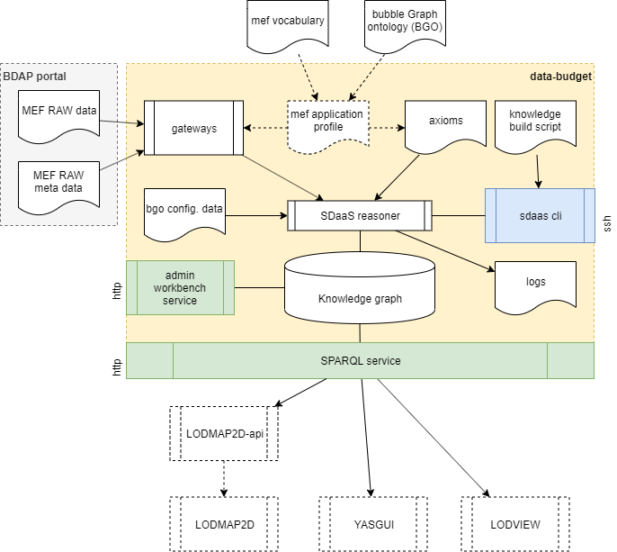

# g0v data-budget

data-budget is a *Smart Data Management Platform* to feed the http://budget.g0v.it/ web application.

**WARNING: this is a complete project refactory. The 2.x versions are no more supported. Please migrate to the new architecture ***

The platform builds a *semantic network* (i.e. a knowledge graph) a about the Italian Government budget, considering :

- **disegno di legge di bilancio** (budget proposal)
- **legge di bilancio** (the actual budget)
- **consuntivo di bilancio** (consolidated balance)

The platform extracts the main financial facts from the official [open data portal](https://bdap-opendata.mef.gov.it) provided 
by the "Ministero dell'Economia e Finance" and produces a knowledge graph according with the 
[fr-ap-mef profile](fr-ap-mef/README.md).

Data consumer agents (e.g. http://budget.g0v.it/), access such knowledge through a SPARQL interface, as suggested by the Semantic Web standards.

The data-budget project uses the [Smart Data as a Service platform (SDaaS)](https://github.com/linkeddatacenter/sdaas-ce) to provide:

- the Semantic Web application profile (i.e. fr-ap-mef ) to define the meaning of Italian Government budget data ;
- a set of gateways to transform the raw data provided by from the [MEF Open Data Portal](https://openbdap.mef.gov.it) into fr-ap-mef linked data;
- a data ingestion engine and a knowledge graph building script to drive the learning and reasoning of Italian Government budget data; 
- an RDF quad-store for persist the knowledge graph; 

data-budget exposes three interfaces:

- a web workbench to interact with the knowledge graph;
- a command line interface to the a data ingestion engine; 
- a [SPARQL service](https://www.w3.org/TR/sparql11-overview) endpoint; 

data-budget is designed to be the data provider component of a general system architecture composed by:

- optional *API interfaces* that query the SPARQL endpoint and expose knowledge graph views as expected by software agents (e.g. LODMAP2D-api). 
- one or more software agents to explore the knowledge graph (e.g LODMAP2D, YASGUI, LODVIEW, etc., etc.)



All used software components are available with **Open Source License**, all data are provided with an **Open Data License**

The platform is shipped with a [Docker](https://docker.com) setup that makes it easy 
to get a containerized development environment up and running. 
If you do not already have Docker on your computer, 
[it's the right time to install it](https://docs.docker.com/install/).

To try the platform, an example stack of services is provided. Just type: 

```
docker-compose build
docker-compose up -d
```

This will start locally the following services:


| Name        | Description                                                   | Port 
| ----------- | ------------------------------------------------------------- | ------- 
| sdaas       | the data-budget management platform                           | 29321    
| api         | an  example API microservice tto feed webapp                  | 29322 
| webapp      | a sample web server using LODMAP2D application                | 20323

- try http://localhost:29321/sdaas to access sdaas workbench
- try http://localhost:29322/app.ttl to test a [LODMAP2D-api](https://github.com/linkeddatacenter/LODMAP2D-api) endpoint
- try http://localhost:29323/partition/overview to see [LODMAP2D](https://github.com/linkeddatacenter/LODMAP2D) explorer in actions.
- access sdaas cli interface  typing `docker exec -ti "here the id of the docker instance running sdaas platform" sdaas`

The first time you start the containers, Docker downloads and builds images for you. It will take some time, but don't worry
this is done only once. Starting servers will then be lightning fast.


To shudown the platform type: 

```
docker-compose down
```

Developers should read [CONTRIBUTING file](CONTRIBUTING.md)

## Support

For answers you may not find in here or in the Wiki, avoid posting issues. Feel free to ask for support on the [Slack](https://copernicani.slack.com/) general room. Make sure to mention **@enrico** so he is notified


## Credits

- the Smart Data Management Platform and LODMAP2D application was developed by [LinkedData.Center](http://LinkedData.Center/)
- data extracted from [Open BDAP portal](https://bdap-opendata.mef.gov.it/) with [CC-BY](http://creativecommons.org/licenses/by/3.0) license
- the RDF datastore and the SPARQL endpoint is based on the [Blazegraph community edition](https://www.blazegraph.com/)

Thanks to all project contributors, to the [Copernicani community](https://copernicani.it/) and to the [g0v asia community](http://g0v.asia) for ideas and support.

## License

The MIT License (MIT). Please see [License File](LICENSE) for more information.
