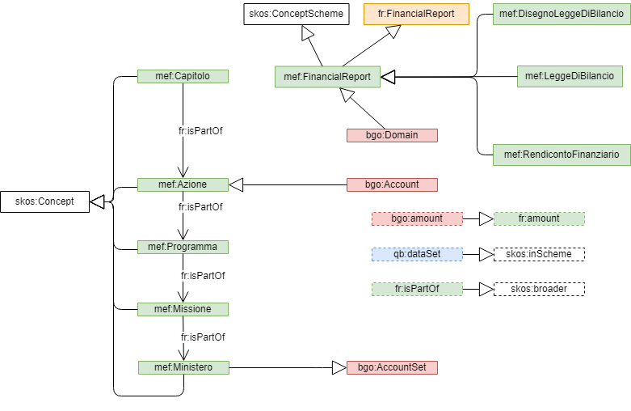

g0v fr-ap-mef
==============

g0v fr-ap-mef is a specialization of the [g0v Financial Report application profile](https://g0v-it.github.io/ontologies/fr-ap) 
and provides a mapping to a [Bubble Graph Ontology](http://linkeddata.center/lodmap-bgo/v1) (BGO) for the Italian government budget.

fr-ap-mef uses the vocabulary [mef](http://w3id.org/g0v/it/mef) to capture the specific Italian budget semantic.

In order to get a manageable number of bgo:Accounts, fr-ap-mef considers the fourth level of the italian budget taxonomy (i.e. "azioni") 
as the focus for the Bubble Graph Ontology; the financial facts (i.e. mef:capitoli) are described as account breakdowns.

The following picture summarizes the mappings introduced by fr-ap-mef profile:



## Axioms

Following axiom apply:

1. only one Financial Report is the domain of a Bubble Graph Ontology: `(x1 a bgo:Domain) ∪  (x2 a bgo:Domain) ⇒  ( x1 = x2 )∪(x1 a mef:FinancialReport)`
2. accounts are the third level of a MEF financial reports: `(x a bgo:Domain) ∩ (y a mef:Azione ) ∩ (y qb:dataSet x ) ⇒ (y a bgo:Account)∪ ( x bgo:hasAccount y)` 
3. *capitolo di spesa* is a breakdown of an account:  `(x a bgo:Account) ∩ (y fr:isPartOf x) ⇒ (x bgo:hasBreakdown y)` 
4. the financial report component/facts hierarchy coincide with the financial report taxonomy: `(y qb:dataSet x) ⇒  (y a skos:Concept) ∪ (x a skos:ConceptScheme) ∪ (y skos:inScheme x)`
5. fr:concept is reflexive `(x a fr:StructuralComponent) ⇒  (x fr:concept x) `
6. bgo:amount is equivalent to a fr:amount: `(x bgo:amount y) ⇒ (x fr:amount y)`
7. *part of* means *broader*: `(x fr:isPartOf y) ⇒ (x skos:broader y)`
8. sdmx-attribute:unitMeasure is <http://publications.europa.eu/resource/authority/currency/EUR>


This snippet (in RDF turtle format) describes a provisional financial report as linked data with fr-ap-mef:

```turtle
@prefix fr: <http://linkeddata.center/botk-fr/v1#>.
@prefix qb: <http://purl.org/linked-data/cube#> .
@prefix mef: <http://w3id.org/g0v/it/mef#> .
@prefix : <#>.

:2019_budget_report a med:LeggeDiBilancio ;
	fr:refPeriod <http://reference.data.gov.uk/id/gregorian-interval/2019-01-01T00:00:00/P1Y> ;
	
:cap_1 a mef:Capitolo;
	qb:dataSet :2019_budget_report ;
	fr:isPartOf :azione_1 ;
	fr:amount 200000000000.00	.

:cap_2 a mef:Capitolo;
	qb:dataSet :2019_budget_report ;
	fr:isPartOf :azione_1 ;
	fr:amount 100000000000.00	.
	
:azione_1 fr:isPartOf :programma_1 .
:programma_1 fr:isPartOf :missione_1 .
:missione_1 fr:isPartOf :ministero_1 .

```

A reasoner that is able to understand g0v fr-ap-mef should able to infer these informations:

```turtle
@prefix skos: <http://www.w3.org/2004/02/skos/core#> .
@prefix bgo: <http://linkeddata.center/lodmap-bgo/v1#> .

:cap_1 a qb:Observation, skos:concept, bgo:HistoryRec ;
   fr:concept :cap_1;
	fr:refPeriod <http://reference.data.gov.uk/id/gregorian-interval/2019-01-01T00:00:00/P1Y> ;
	fr:unit <http://publications.europa.eu/resource/authority/currency/EUR> ;
	bgo:amount 200000000000.00	.
	
:cap_2 a qb:Observation, skos:concept, bgo:HistoryRec ;
	fr:refPeriod <http://reference.data.gov.uk/id/gregorian-interval/2019-01-01T00:00:00/P1Y> ;
   fr:concept :cap_2;
	fr:unit <http://publications.europa.eu/resource/authority/currency/EUR> ;
	bgo:amount 100000000000.00	.

:azione_1 a qb:Observation, fr:Component, skos:concept, bgo:Account;
   fr:concept :azione_1;
	qb:dataSet :2019_budget_report ;
	fr:refPeriod <http://reference.data.gov.uk/id/gregorian-interval/2019-01-01T00:00:00/P1Y> ;
	fr:unit <http://publications.europa.eu/resource/authority/currency/EUR> ;
   bgo:hasBreakdown :cap_1, :cap_2 ;
	bgo:amount 300000000000.00	.
	fr:amount 300000000000.00	.
   
:programma_1 a qb:Observation, fr:Component,  skos:concept;
   fr:concept :programma_1;
	fr:refPeriod <http://reference.data.gov.uk/id/gregorian-interval/2019-01-01T00:00:00/P1Y> ;
	fr:unit <http://publications.europa.eu/resource/authority/currency/EUR> ;
	fr:amount 300000000000.00 .
   
:missione_1 a qb:Observation, fr:Component,  skos:concept;
   fr:concept :missione_1;
	fr:refPeriod <http://reference.data.gov.uk/id/gregorian-interval/2019-01-01T00:00:00/P1Y> ;
	fr:unit <http://publications.europa.eu/resource/authority/currency/EUR> ;
	fr:amount 300000000000.00 .
   
:ministero_1 a qb:Observation, fr:Component,  skos:concept, bgo:AccountSet;
   fr:concept :ministero_1;
	qb:dataSet :2019_budget_report ;
	fr:refPeriod <http://reference.data.gov.uk/id/gregorian-interval/2019-01-01T00:00:00/P1Y> ;
	fr:unit <http://publications.europa.eu/resource/authority/currency/EUR> ;
	fr:amount 300000000000.00 ;
	bgo:hasAccount :azione_1 .
    

:2019_budget_report a fr:FinancialReport, qb:DataSet, skos:ConceptScheme, bgo:Domain; 
	skos:hasTopConcept :ministero_1  ;
	bgo:hasOverview [
		bgo:hasPartitions [
			bgo:hasPartition [
				bgo:hasAccountSubset :ministero_1
			]
		]
	]
.
	
:cap_1 skos:broader :azione_1 .
:cap_2 skos:broader :azione_1 .
:azione_1 skos:broader :programma_1; skos:narrower :cap_1, :cap_2 .
:programma_1 skos:broader :missione_1; skos:narrower azione_1 .
:missione_1 skos:broader :ministero_1; skos:narrower programma_1 .
:ministero_1  skos:narrower missione_1 .

```
