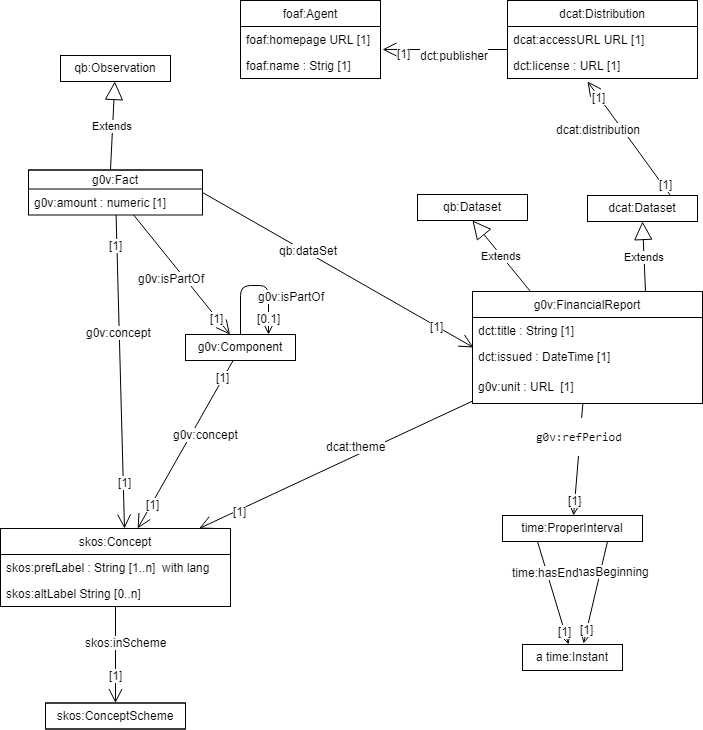
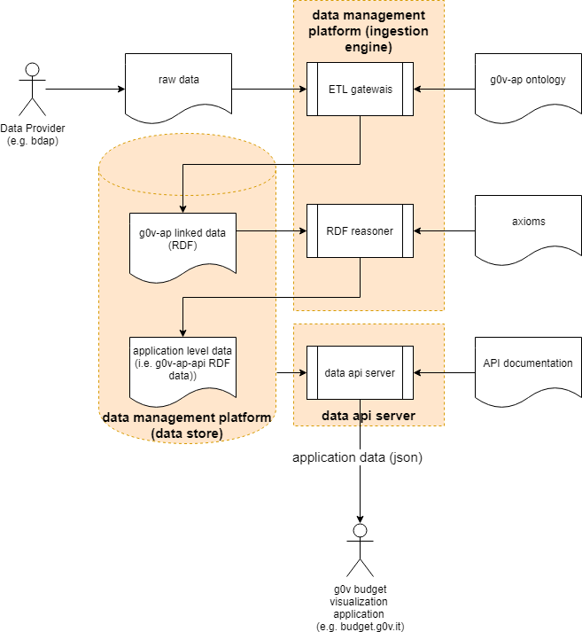

g0v-ap
-------

g0v-ap is an general Semantic Web Application defined with [OWL](https://www.w3.org/TR/owl2-primer/) suitable to annotate a government budget data with the purpose of supporting budget visualization applications (e.g. http://budget.g0v.it/).  

It captures different perspectives of a government budget data like historical trends, cross-department and component breakdown of tax by government. 

g0v-ap is an application profile that builds upon the following RDF vocabularies:: 

- the [W3C RDF Data Cube Vocabulary](https://www.w3.org/TR/vocab-data-cube), to describe the outgoings/incomes accounts observations
- the [Data Catalog Vocabulary](https://www.w3.org/TR/vocab-dcat/) to describe the dataset metadata
- the [SKOS](https://www.w3.org/TR/skos-primer) to describe balance taxonomy.
- The [DCMI Metadata Terms](http://dublincore.org/documents/dcmi-terms/)
- some facilities from [sdmx ontologies](https://sdmx.org/)
- the [g0v-ap Vocabulary](http://data.budget.g0v.it/g0v-ap/v1) that defines few application classes, attributes and bindings.

g0v-ap also reuses some individual references to linked open data provided by [UK e-gov](https://github.com/alphagov/datagovuk_reference) and by [dbpedia](http://dbpedia.org/).

g0v-ap is inspired by the [Financial Report Semantics and Dynamics Theory](doc/Theory-2017-06-26.pdf). The main concept in g0v-ap is the **Fact** that is an observation of a money amount described with some attributes: a reference period (e.g. year 2018), etc, etc. Facts  are grouped in **Component**s also described with a concept in a taxonomy, the set of all components define a **FinancialReport** .

Every fact and every component is strictly related to a taxonomy of **Concepts** (1/1 relation). For Concepts g0v-apy reuses the skos vocabulary. 
The one-o-one relation between a fact and a concept, could theoretically prevent any historical analysis and financial report comparison. 
In a practical use, the taxonomies in different financial reports of for the same legal entity, do not change very much. 
For this reason it is possible to map different fact concepts, defined in different taxonomies, throuh the skos:closeMatch attribute. 
A reasoner MAY uses this information to relate different financial reports and to trace historical trend for a specific Fact or Component.

Some fact properties, if not explicitly defined, can be inherited form the financial report attributes, that provide a default. Also the groups hierarchy can be inferred from the concepts taxonomy structure.




In this snippet (in RDF turtle format) describes a provisional financial report as linked data with g0v-ap:

```
@prefix g0v: <http://data.budget.g0v.it/g0v-ap/v1#>.
@prefix kees: <http://linkeddata.center/kees/v1#> .
@prefix skos: <http://www.w3.org/2004/02/skos/core#> .
@prefix dct:  <http://purl.org/dc/terms/> .
@prefix daq: <http://purl.org/eis/vocab/daq#>.
@prefix interval: <http://reference.data.gov.uk/def/intervals/> .
@prefix qb:       <http://purl.org/linked-data/cube#> .
@prefix : <#>.

:2018_budget_report a g0v:FinancialReport ;
	dcat:theme <https://it.dbpedia.org/resource/Bilancio_dello_Stato> ;
	g0v:refPeriod <http://reference.data.gov.uk/id/gregorian-interval/2018-01-01T00:00:00/P1Y> ;
	g0v:unit <http://dbpedia.org/resource/Euro> .
	
:facx_x a g0v:Fact;
	g0v:concept :level_5_account_02001200010001 ;
	qb:dataSet :2018_budget_report ;
	g0v:amount 288149000000.00	.

:facx_y a g0v:Fact;
	g0v:concept :level_5_account_02001200020001 ;
	qb:dataSet :2018_budget_report ;
	g0v:amount 881493000.00	.
	
:level_5_account_A102001200010001 a skos:Concept ;skos:broader :level_4_account_A10200120001 .
:level_5_account_A102001200020001 a skos:Concept ;skos:broader :level_4_account_A10200120002 .
:level_4_account_A10200120001 a skos:Concept ; skos:broader :level_3_account_A1020012 .
:level_3_account_A1020012 a skos:Concept ; skos:broader :level_2_account_A102 .
::level_2_account_A102 a skos:Concept ; skos:broader :top_level_account_A1 .
:top_level_account_A1 a skos:Concept .
:budget_taxonomy a skos:ConceptScheme; skos:hasTopConcept :top_level_account_A1 .

:2018_quality a qb:Observation ;
    daq:computedOn :2018_budget_report ; 
    daq:metric kees:trustGraphMetric;
    daq:value 0.9 ;
    daq:isEstimated true 
.
```

A reasoner that is able to understand skos and g0v-ap axioms is able to generate the missing mandatory properties and relations. e.g:

```
:facx_x a g0v:Fact, qb:Observable;
	g0v:concept :level_5_account_02001200010001 ;
	qb:dataSet :2018_budget_report ;
	g0v:refPeriod <http://reference.data.gov.uk/id/gregorian-interval/2018-01-01T00:00:00/P1Y> ;
	g0v:unit <http://dbpedia.org/resource/Euro> ;
	g0v:isPartOf :component_z ;
	g0v:amount 288149000000.00	.

:component_z a g0v:Component;
    g0v:concept :level_4_account_A10200120001;
    g0v:isPartOf :component_k.
    
:level_4_account_A10200120001 a skos:Concept ; 
    skos:broader :level_3_account_A1020012 ;
    skos:narrower 
        :level_5_account_A102001200010001,
        :level_5_account_A102001200020001 .

...

```


The directory [examples](examples/README.ttl) provides some data and axioms ready to use in a RDF store with a SPARQL update and query capabilities.

## How to use g0v-ap

If you want to write an application that analyzes/visualizes budget data, first you have to transform the government budget data in RDF linked 
data using g0v-ap classes and properties. The produced linked data can be stored in a RDF store and queried using the [SPARQL language](http://www.w3.org/TR/sparql11-query/).
With SPARQL update you can also easily write rules to generate (i.e. infers) other data view to simplify the development of your application.
In practice, you have to extend g0v-ap to match your specific application needs.

In this picture the typical dataflow:




The [g0v-ap-api vocabulary](http://data.budget.g0v.it/g0v-ap-api/v1) is an example of a g0v-ap specialization used to model data for the data-budget api component.


## Edit g0v-ap ontology

g0v-ap is expressed in a [owl file](g0v-ap.owl) serialized as RDF xml. You can edit the file by hand or using [Protégé](https://protege.stanford.edu/)

## Practice with the g0v-ap

To practice with g0v-ap you need a RDF data store and some data. [Blazegraph](https://www.blazegraph.com/) is a good starting point. For a quick start, use this docker:

```	
docker run --name blazegraph -d -p 9999:8080 lyrasis/blazegraph:2.1.4
```

1. Connect to the blazegraph workbench SPARQL update tab pointing the browser to http://localhost:9999/sdaas/#update
2. Load examples/example_data.ttl in a RDF triple store that support SPARQL Query and SPARQL Update.
2. Execute examples/skos_axioms.sparql_update create maps between taxonomies and other base skos rules
3. Execute examples/g0v_axioms.sparql_update to load external data and create low level components
4. Execute examples/app_axioms.sparql_update to generate application level data (e.g. budget amount aggregations)
5. Try SPARQL queries in examples directory


## Generating g0v-ap ontology documentation on-the-fly

Here find a container to run a [lode server](https://github.com/essepuntato/LODE) to generate human readable document for g0v-ap ontology.
 
```	
docker build . -t lode
docker run -d -v g0v-ap.owl:/lode/LODE-master/src/main/webapp/g0v-ap.owl --name lode -p 9090:8080 lode
```

Point your browser to http://localhost:9090/lode/extract?url=localhost:8080/lode/g0v-ap.owl

